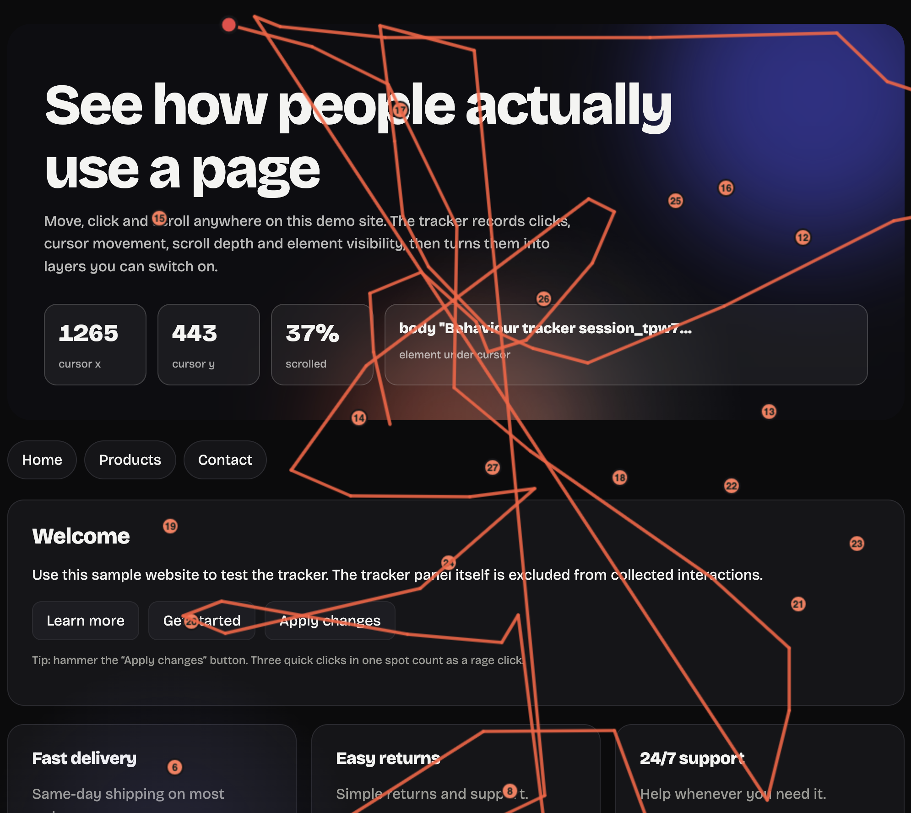

# Website Behaviour & Visibility Tracker

A single-file tool that records how visitors use a webpage and turns it into live visuals: click heatmaps, scatter dots, mouse paths and scroll depth. It runs entirely in the browser with plain HTML, CSS and JavaScript.



## About

Website owners often don't know where visitors click, how far they scroll or which parts of a page they ignore. This project explores that question. It watches how a user interacts with a page and shows the results as it happens.

Every click, cursor movement and scroll is recorded with its exact position on the page. The side panel turns that data into visuals you can switch on and off: numbered click dots, a colour heatmap, a scatter plot and a mouse path that you can replay. It also shows live stats, a map of how far down the page you have been, and a ranking of the most-clicked elements.

I built it as a class project to learn how browser events, the Canvas API and the `IntersectionObserver` API work together. Everything runs locally in the browser, so no data ever leaves your device.

## Features

- **Tracking:** clicks, mouse movement, scroll depth, element visibility, page visibility and rage clicks
- **Visual layers:** numbered click dots, heatmap, scatter plot, mouse points, mouse path and path replay
- **Dashboard:** live stats, page map, activity chart, most-clicked elements and a filterable event log
- **Interface:** animated design, light and dark themes, and a responsive collapsible panel
- **Export:** JSON, clicks as CSV, or copy to clipboard

## How to Run

1. Download or clone this repository.
2. Open `index.html` in your browser.
3. Move, click and scroll around, then use the side panel to view the results.

No installation or build step is needed.

## Shortcuts

| Key | Action |
| --- | --- |
| `T` | Show or hide the panel |
| `P` | Pause or resume tracking |
| `H` | Toggle the heatmap |
| `R` | Replay the mouse path |

## Console API

```js
Tracker.start();           // resume tracking
Tracker.stop();            // pause tracking
Tracker.showHeatmap();     // show the heatmap
Tracker.replay();          // replay the cursor path
Tracker.exportJSON();      // download the session as JSON
Tracker.getTrackingData(); // return the data as an object
Tracker.reset();           // clear all data
```

## Privacy

All data stays in your browser. Nothing is sent to a server, and nothing is saved unless you export it.

## Built With

HTML, CSS and JavaScript, with no frameworks or libraries.
